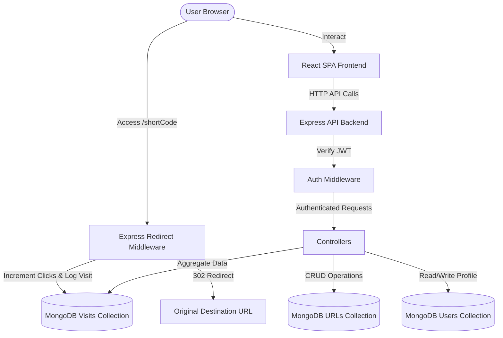

# LinkSnap - Production-Grade URL Shortener with Real-Time Analytics

LinkSnap is a modern, high-performance, full-stack URL shortener application featuring secure authentication, a custom URL routing engine, real-time analytics aggregation, an interactive workspace sandbox, bulk CSV creation, custom destination editing, and secure public statistics sharing.

Designed with a premium, responsive **Light SaaS Aesthetic**, it leverages seamless micro-animations, Recharts data visualization, and atomic database aggregations.

---

## 🧠 Problem Approach & Planning

### 1. Problem Statement & Scope Analysis
The primary goal is to build a full-stack URL shortener that simplifies sharing while delivering rich user analytics. The system must handle:
* **Unique Code Generation**: Generating unique short slugs while supporting custom vanity aliases.
* **Redirection Performance**: Emitting quick HTTP redirections (status `302 Found`) while capturing visitor metadata.
* **Real-time Analytics**: Aggregating page views, click rates over time, device profiles, and browser demographics without degrading lookup performance.
* **Privacy Compliance**: Disseminating public stats without exposing sensitive data (e.g., visitor IP addresses and full user agents).

### 2. Technical Approach & Design Decisions
* **Database Modeling**: We utilize Mongoose with two core collections: `Url` (mapping slugs to destination targets and click counters) and `Visit` (tracking each redirect transaction). The `Url` collection uses unique indexes on `shortCode` to optimize lookup queries.
* **Concurrency & Aggregation**: To avoid race conditions in multi-user environments, link click counters are incremented atomically using MongoDB's `$inc` operator. Daily click trend graphs are aggregated using MongoDB's `$group` pipeline, calculating time series metrics across day intervals efficiently.
* **Frontend State Synchronization**: To create a highly responsive experience, the dashboard uses React context for auth state tracking, and local state management for the inline filters. Single link drilldowns dynamically filter click trends, browser distributions, and recent log lists globally across the workspace.

### 3. Execution & Implementation Roadmap
* **Phase 1: Foundation (Auth & Redirection)**: Designed user session tokens (JWT) and built the core router resolving shortcode parameters to destination redirects while creating log entries.
* **Phase 2: Analytics & Dashboard**: Integrated Recharts in the React frontend, created donut charts for browser/device distributions, and added the access log lists.
* **Phase 3: Extended Features (CSV, Editing, Public Stats)**: Built bulk file upload parser on the client, enabled target editing for existing slugs, and established the unauthenticated public stats route utilizing IP/User-Agent masking projection.

---

## 🗺️ Application Architecture



### Technical Stack
* **Frontend**: React (Vite), Framer Motion, Recharts, React Icons, Tailwind CSS, Axios.
* **Backend**: Node.js, Express, Express Validator, Express Useragent, Morgan, Swagger UI (API Docs).
* **Database**: MongoDB (via Mongoose ODM).
* **Security & Reliability**: JWT (JSON Web Tokens), bcrypt.js password hashing, Helmet security headers, rate limiting (Express Rate Limit), CORS headers, and anonymous IP masking for public compliance.

---

## 🚀 Listing of Features

### 🔒 1. Authentication & Security
* **User Signup & Login**: Secure credential submission with bcrypt password hashing on the database layer.
* **Protected Dashboard Routes**: JSON Web Tokens (JWT) guard all private routes. Active requests include a bearer token in authorization headers.
* **Auto-Logout on Session Expiry**: Global Axios response interceptors immediately wipe local storage and trigger a logout route if any API endpoint returns a `401 Unauthorized` status.

### 🔗 2. URL Shortening Engine
* **Single Generator**: Submit long destination URLs with an optional custom vanity alias and calendar expiry date.
* **Validation**: Input fields check for absolute URI patterns (prefixed with `http://` or `https://`) and validate character rules for custom aliases.
* **Atomicity**: Short URL click counts increment atomically on Mongoose (`$inc: { clickCount: 1 }`) to prevent transaction race conditions.

### 📊 3. Interactive Analytics Hub
* **Unified Workspace Filter (Single Link Drilldown)**: Drill down into a specific link's click trend, browser shares, device distribution, and recent logs directly from the workspace view without navigating away.
* **Trend Visualizations**: Area, Line, and Bar chart configurations powered by Recharts, showing daily click trends over the last 7 days.
* **Visitor Metrics**: Track user-agent details (browser, device brand, timestamp).

### 🛠️ 4. Interactive Developer Sandbox
* **Route Redirect Simulator**: Step-by-step trace showing the backend path during a redirect request: from validation and MongoDB checks to logging metadata and emitting a `302 Redirection` header.
* **Traffic Injection Sandbox**: Generate mock traffic (10 to 200 visits spread over 1 to 30 days) to populate charts and test analytical views instantly.

### 🎁 5. Complete Hackathon Bonus Features
* **Bulk CSV Import**: Drag-and-drop or select a `.csv` file. The frontend reads, parses, validates, and renders a live preview of the entries before dispatching a single payload to a dedicated bulk endpoint.
* **Edit Destination URL**: Modify destination URLs of existing slugs via a secure `PUT` modal on the dashboard.
* **Public Stats Page**: Share real-time analytics for any URL via `/stats/:shortCode`. Underneath, the public route `GET /api/analytics/public/:shortCode` utilizes projection `.select('browser device timestamp')` to ensure visitor IP addresses and full User Agent strings are omitted, keeping visitor data compliant.

---

## 🛠️ Setup & Installation Instructions

### Prerequisites
* [Node.js](https://nodejs.org/) (v16+ recommended)
* [MongoDB Atlas](https://www.mongodb.com/cloud/atlas) or a local MongoDB community instance.

### 1. Backend Configuration
1. Navigate to the `backend` folder:
   ```bash
   cd backend
   ```
2. Install dependencies:
   ```bash
   npm install
   ```
3. Create a `.env` file based on `.env.example`:
   ```env
   PORT=5000
   MONGO_URI=your_mongodb_connection_string
   JWT_SECRET=your_jwt_secret_key
   BASE_URL=http://localhost:5000
   NODE_ENV=development
   ```
4. Start the backend development server:
   ```bash
   npm run dev
   ```

### 2. Frontend Configuration
1. Navigate to the `Client` folder:
   ```bash
   cd ../Client
   ```
2. Install dependencies:
   ```bash
   npm install
   ```
3. Start the Vite development server:
   ```bash
   npm run dev
   ```
4. Access the web app in your browser at `http://localhost:5173`.

---

## 📝 Assumptions Made
1. **CSV Structure**: The CSV parser assumes columns format: `originalUrl,customAlias,expiryDate`. Any lines that do not have a valid URL in the first column will be filtered out.
2. **Anonymous Metrics**: Visitor logs on the public stats page are intended to showcase total volumes and client distributions (browsers/devices) without exposing individual tracking details (IPs, complete user agents).
3. **Local Dev Routing**: In the development environment, Vite runs on port `5173` while Express runs on port `5000`. Short links are created using the backend base URL (`http://localhost:5000/:shortCode`) to handle redirection.

---

## 📺 Video Explanation & Demonstration
* [Click here to watch the Loom explanation video](https://www.loom.com/share/0db91a41925041ba87110262badeae70)

---

## 📊 Sample Output and Logs

### Standard Access Log Example (`logs/access.log`)
```
::1 - - [04/Jun/2026:08:44:12 +0530] "GET /google-search HTTP/1.1" 302 - "-" "Mozilla/5.0 (Windows NT 10.0; Win64; x64) AppleWebKit/537.36 (KHTML, like Gecko) Chrome/125.0.0.0 Safari/537.36"
::1 - - [04/Jun/2026:08:44:55 +0530] "GET /api/urls?page=1&limit=10 HTTP/1.1" 200 482 "http://localhost:5173/" "Mozilla/5.0 (Windows NT 10.0; Win64; x64) AppleWebKit/537.36 (KHTML, like Gecko) Chrome/125.0.0.0 Safari/537.36"
```

### Sample MongoDB Collections Schema Representation

#### `users` Collection
| Field | Type | Description |
| :--- | :--- | :--- |
| `_id` | ObjectId | MongoDB unique identifier |
| `name` | String | User's full name |
| `email` | String | Unique user login email |
| `password` | String | bcrypt hashed password |
| `createdAt` | Date | Document creation timestamp |

#### `urls` Collection
| Field | Type | Description |
| :--- | :--- | :--- |
| `_id` | ObjectId | MongoDB unique identifier |
| `userId` | ObjectId | Reference to creator user |
| `originalUrl` | String | Full destination target URL |
| `shortCode` | String | Unique shortened code slug |
| `clickCount` | Number | Total visitor click counts |
| `qrCodeUrl` | String | Base64 encoded DataURL for QR scanner |
| `expiryDate` | Date | Optional date bounds |
| `createdAt` | Date | Document creation timestamp |

#### `visits` Collection
| Field | Type | Description |
| :--- | :--- | :--- |
| `_id` | ObjectId | MongoDB unique identifier |
| `urlId` | ObjectId | Reference to parent URL document |
| `ipAddress` | String | Masked visitor IP address |
| `browser` | String | UserAgent parsed browser name |
| `device` | String | UserAgent parsed device (Desktop/Mobile) |
| `userAgent` | String | Unabbreviated client User Agent string |
| `timestamp` | Date | Visit log entry timestamp |

---

This project is a part of a hackathon run by https://katomaran.com
